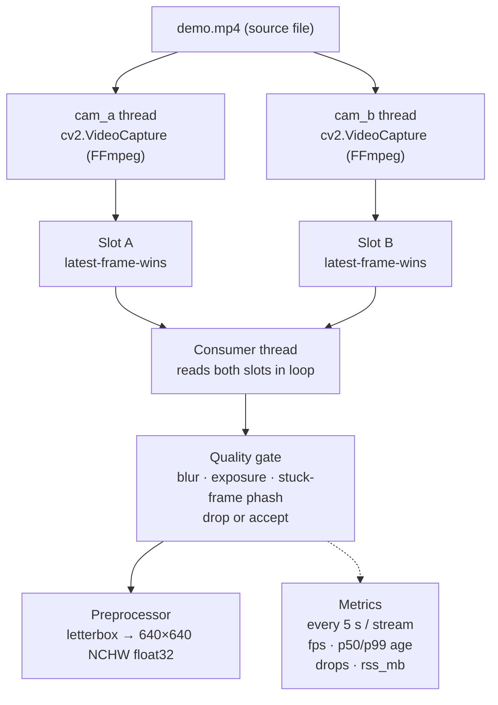

# Real-Time Video Pipeline

*(Note: Since no `demo.mp4` was provided in the assignment materials, a random video of Earth at night was used as `demo.mp4`. All testing and quality thresholds were calibrated against this specific video.)*

## Architecture


*SIGINT &rarr; clean shutdown < 2 s - no zombie threads - stable RSS*

## Usage
`pip install -r requirements.txt && python run.py --input demo.mp4`

## Expected Output Format

While the pipeline runs, it will emit a JSON metrics report every 5 seconds detailing the performance, frame drops, and rejection reasons for each camera stream.

```json
{
  "cam_a": {
    "fps_capture": 30.0,
    "recovery_count": 0,
    "frames_dropped": 0,
    "blur_rejected": 0,
    "exposure_rejected": 149,
    "stuck_rejected": 0,
    "total_checked": 149,
    "total_accepted": 0,
    "age_ms_min": 0.0,
    "age_ms_max": 16.0,
    "age_ms_avg": 6.5,
    "age_ms_p99": 16.0,
    "preprocessed": 0
  },
  "cam_b": {
    "fps_capture": 30.0,
    "recovery_count": 0,
    "frames_dropped": 1,
    "blur_rejected": 0,
    "exposure_rejected": 149,
    "stuck_rejected": 0,
    "total_checked": 149,
    "total_accepted": 0,
    "age_ms_min": 0.0,
    "age_ms_max": 31.0,
    "age_ms_avg": 8.1,
    "age_ms_p99": 31.0,
    "preprocessed": 0
  }
}
```